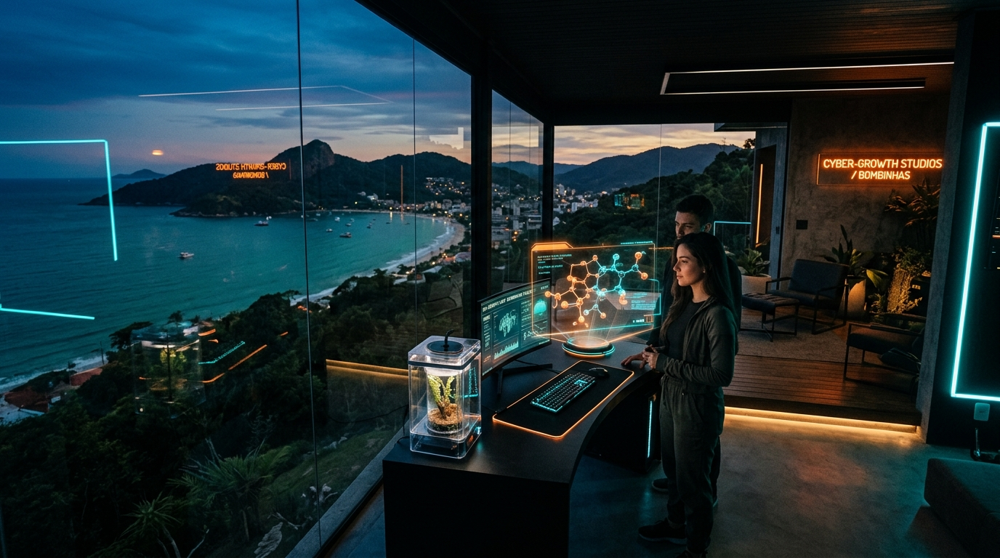

# 🚀 Portfolio Artes do Sul

## 🛡️ Sentinel Status

- **Status:** 🟢 Produção
- **Tier:** S
- **Health:** 98% / **ROI Potencial:** Alto (Vitrine Institucional, Portfólio & Conversão)
- **Stack:** Astro 4, TypeScript, Tailwind CSS, PWA, TinaCMS, Pagefind

---

Portal e acervo oficial da Artes do Sul — Soluções para Internet. Vitrine de mais de 30 projetos em produção contínua, blog técnico integrado, simulador de briefing executivo com gating dinâmico e rastreador de exploração com persistência local no navegador.

<div align="center">



<br/><br/>

[](#-sentinel-status)
[](#-sentinel-status)
[](#-métricas--performance)
[](#-pwa-first)
[](LICENSE)

</div>

---

## 📌 Índice

- [🎯 Visão Geral](#-visão-geral)
- [📘 Roteiro Técnico Passo a Passo](ROTEIRO_DESENVOLVIMENTO.md)
- [📋 Como Cadastrar Projetos](CADASTRO_PROJETOS.md)
- [✨ Principais Funcionalidades](#-principais-funcionalidades)
- [🏗️ Arquitetura & Stack](#️-arquitetura--stack)
- [📊 Métricas & Performance](#-métricas--performance)
- [🛡️ Segurança & Privacidade](#️-segurança--privacidade)
- [👨🏻‍💻 Como Executar Localmente](#-como-executar-localmente)
- [📁 Estrutura do Projeto](#-estrutura-do-projeto)
- [📐 Configuração & Customização](#-configuração--customização)
- [📜 Licença & Assinatura](#-licença--assinatura)

---

## 🎯 Visão Geral

Desenvolvido para consolidar os **25 anos de experiência da Artes do Sul** (1999–2026) em engenharia web, desenvolvimento de sistemas, e-commerce e portais de alta escala. O projeto aplica o padrão visual **Cyber-Growth** inspirado nas interfaces do Linear e Stripe, adaptado ao contexto do "Brasil Profundo".

---

## ✨ Principais Funcionalidades

### 1. 🖼️ Hero Section Masterpiece

- Visual cinematográfico integrado com gradientes multicamadas sobrepostos.
- Badges de validação em tempo real: `25+ Anos no Mercado`, `30+ Projetos Ativos`, `Score 98+ Performance`.
- CTAs diretos com iluminação cyber para exploração do acervo, simulador de briefing e contato direto via WhatsApp.

### 2. 📈 Growth Tracker (Persistência Local)

- Salva o progresso de navegação do visitante no `localStorage` sem necessidade de login.
- Medidor de porcentagem e barra de progresso em gradiente (_"X de 32 projetos explorados"_).
- Botão interativo de **Favoritar (★)** nos cards com filtro rápido de 1 clique (_Todos_, _★ Favoritos_, _Reset_).

### 3. 🔍 Busca Instantânea & Filtros por Categoria

- Campo de pesquisa em tempo real que filtra o acervo por título, descrição e tags instantaneamente sem recarregar a página.
- Chips de categoria com contadores dinâmicos de projetos por tag.
- Botão de cópia rápida do link do projeto com feedback visual (_"✓ Copiado!"_).

### 4. ⚡ Simulador Interativo & Gating Engine

- **3 Rotas de Projeto**: _Essencial_, _Profissional_ e _Sob Medida_.
- **Gating Dinâmico**: Módulos restritos (`🔒 Pro` / `🔒 Sob Medida`) com promoção de rota em 1 clique.
- **Painel Executivo de Briefing**: Estimativas dinâmicas de prazo, infraestrutura em nuvem recomendada, modelo 20/80 e tags de requisitos com remoção rápida (`✕`).
- Exportação com 1 clique para a área de transferência e disparo direto para o WhatsApp pré-formatado.

### 5. 📱 PWA First (Offline-Ready)

- Manifesto configurado para display `standalone` e tema dark (`#050505` / `#ff6b35`).
- Service Worker com estratégia **Stale-While-Revalidate** e cache offline.
- Monitor de conexão online/offline em tempo real (`● ONLINE`).
- Banner A2HS (_Add to Home Screen_) com persistência de fechamento.

### 6. 📝 Diário de Bordo & CMS

- Mais de 120 artigos técnicos e reflexões no acervo editorial.
- Indexação estática ultra-veloz via **Pagefind** (158 rotas indexadas).
- Compatibilidade nativa com **TinaCMS** para edição de conteúdo.

---

## 🏗️ Arquitetura & Stack

| Camada             | Tecnologia                                             | Finalidade                                                        |
| ------------------ | ------------------------------------------------------ | ----------------------------------------------------------------- |
| **Core Framework** | [Astro 4](https://astro.build/)                        | Geração estática (SSG) de alta velocidade e zero JS desnecessário |
| **Linguagem**      | [TypeScript](https://www.typescriptlang.org/)          | Tipagem estática, interfaces e contratos de dados                 |
| **Estilização**    | [Tailwind CSS](https://tailwindcss.com/) + CSS Vanilla | Design System Cyber-Growth com tokens e glassmorphism             |
| **Tipografia**     | `Bricolage Grotesque` / `JetBrains Mono` / `Manrope`   | Identidade visual cirúrgica e legibilidade editorial              |
| **PWA & Cache**    | Service Worker + Web App Manifest                      | Carregamento instantâneo e suporte offline                        |
| **Busca Estática** | [Pagefind](https://pagefind.app/)                      | Motor de busca embutido com indexação completa de HTML            |
| **Animações**      | [Motion One](https://motion.dev/)                      | Transições suaves e micro-interações                              |
| **CMS**            | [TinaCMS](https://tina.io/)                            | Edição visual e gerenciamento de posts em Markdown/MDX            |

---

## 📊 Métricas & Performance

- **Lighthouse Score:** 98–100 em Performance, Acessibilidade e SEO.
- **Core Web Vitals:** LCP < 1.2s, FID < 10ms, CLS 0.
- **Rotas Estáticas:** 158 páginas compiladas e indexadas.
- **Zero Layout Shift:** Compensação de scrollbar no layout raiz.

---

## 🛡️ Segurança & Privacidade

> [!NOTE]
> O projeto adota arquitetura estática imutável:
>
> - Sem cookies invasivos de rastreamento de terceiros.
> - O histórico do Growth Tracker e favoritos é armazenado estritamente no dispositivo do usuário (`localStorage`).
> - Comunicações via WhatsApp abrem a aplicação oficial do cliente sem intermediários.

---

## 👨🏻‍💻 Como Executar Localmente

### Pré-requisitos

- **Node.js** >= 18.17.0
- **pnpm** (recomendado) ou npm

### Passo a passo

```bash
# 1. Clone o repositório
git clone https://github.com/artesdosul/portfolio-astro.git
cd portfolio-astro

# 2. Instale as dependências
pnpm install

# 3. Inicie o servidor de desenvolvimento
pnpm run dev

# 4. Ou compile a versão final de produção
pnpm run build

# 5. Visualize a compilação localmente
pnpm run preview
```

### Comandos Disponíveis

| Comando        | Descrição                                                       |
| -------------- | --------------------------------------------------------------- |
| `pnpm dev`     | Inicia o servidor com TinaCMS + Astro dev                       |
| `pnpm start`   | Inicia apenas o Astro dev diretamente                           |
| `pnpm build`   | Compila o projeto estático e executa a indexação do Pagefind    |
| `pnpm preview` | Executa o servidor local para pré-visualização da pasta `dist/` |
| `pnpm format`  | Formata o código com Prettier                                   |
| `pnpm lint`    | Valida código e padrões com ESLint                              |

---

## 📁 Estrutura do Projeto

```
portfolio-astro/
├── public/
│   ├── assets/img/             # Imagens de projetos, posts e hero
│   ├── manifest.webmanifest    # Manifesto PWA standalone
│   ├── sw.js                   # Service Worker offline-first
│   └── projetos-online.json    # Base de dados de projetos em produção
├── src/
│   ├── components/
│   │   ├── HeroMasterpiece.astro     # Seção Hero Cyber-Growth com badges
│   │   ├── GrowthTracker.astro       # Rastreador de progresso com localStorage
│   │   ├── PortfolioList.astro       # Acervo com busca e filtros por tag
│   │   ├── PortfolioCard.astro       # Card com preview, copy link e favoritos
│   │   ├── InteractiveSimulator.astro# Simulador de briefing com gating
│   │   ├── Header.astro              # Navegação sticky com elevação
│   │   ├── Footer.astro              # Rodapé branded com assinatura
│   │   ├── GoTop.astro               # Botão flutuante de retorno ao topo
│   │   └── PWABanner.astro           # Prompt A2HS de instalação
│   ├── layouts/
│   │   └── BaseLayout.astro          # Layout base com providers de tema
│   ├── pages/
│   │   ├── index.astro               # Página inicial principal
│   │   ├── tags/                     # Listagem de tags
│   │   ├── posts/                    # Listagem paginada de artigos
│   │   └── post/                     # Páginas individuais de artigos
│   ├── styles/
│   │   └── global.css                # Design system e tokens Cyber-Growth
│   └── utils/                        # Utilitários de dados, portfolio e slugs
├── astro.config.mjs
├── tailwind.config.cjs
└── package.json
```

---

## 📐 Configuração & Customização

- **Cadastrando Projetos no Acervo:** Consulte o guia operacional em [CADASTRO_PROJETOS.md](CADASTRO_PROJETOS.md) para cadastrar novas aplicações em `public/projetos-online.json`.
- **Metadados do Site:** Configure título, descrição e autor em `src/data/site.config.ts`.
- **Artigos do Blog:** Crie novos arquivos `.md` ou `.mdx` em `src/content/blog/`.
- **Links Sociais:** Altere as redes em `src/data/links.ts`.

---

## 📜 Licença & Assinatura

Este projeto é distribuído sob a licença **GPL-3.0**.

Uma criação **[@artesdosul](https://artesdosul.com/)** — _Soluções para Internet com Arte e Precisão Técnica._  
Bombinhas · Santa Catarina · Brasil.

---

_Este documento segue o Padrão Sentinel para Documentação Estruturada._
