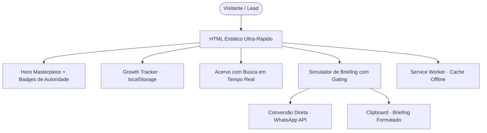

# 📘 Roteiro Técnico de Desenvolvimento: Portfolio & Masterpiece Dashboard Cyber-Growth

> **Manual de Engenharia e Arquitetura Web**  
> _Como construir um portfólio de alta conversão, estética cirúrgica e tração real do zero usando Astro, TypeScript, Tailwind CSS e PWA._  
> **Padrão:** Artes do Sul Cyber-Growth // 2026

---

## 📑 Sumário Executivo

1. [Visão Geral & Filosofia Arquitetural](#1-visão-geral--filosofia-arquitetural)
2. [Stack Tecnológica & Racional de Decisão](#2-stack-tecnológica--racional-de-decisão)
3. [Setup Inicial Passo a Passo](#3-setup-inicial-passo-a-passo)
4. [Design System: Tokens & Estética Cyber-Growth](#4-design-system-tokens--estética-cyber-growth)
5. [Modelagem de Dados dos Projetos](#5-modelagem-de-dados-dos-projetos)
6. [Implementação dos Componentes Mestres](#6-implementação-dos-componentes-mestres)
   - [6.1 Hero Masterpiece](#61-hero-masterpiece)
   - [6.2 Growth Tracker (Persistência Local)](#62-growth-tracker-persistência-local)
   - [6.3 Busca em Tempo Real & Filtros de Acervo](#63-busca-em-tempo-real--filtros-de-acervo)
   - [6.4 Card de Projeto com Utilitários](#64-card-de-projeto-com-utilitários)
   - [6.5 Simulador Interativo & Gating Engine](#65-simulador-interativo--gating-engine)
   - [6.6 Header Sticky com Elevação & Go-To-Top](#66-header-sticky-com-elevação--go-to-top)
   - [6.7 Rodapé Branded Obrigatório](#67-rodapé-branded-obrigatório)
7. [Arquitetura PWA First & Offline-Readiness](#7-arquitetura-pwa-first--offline-readiness)
8. [Motor de Busca Estática (Pagefind)](#8-motor-de-busca-estática-pagefind)
9. [Pipeline de Build, Otimização & Deploy](#9-pipeline-de-build-otimização--deploy)
10. [Checklist de Qualidade & Troubleshooting](#10-checklist-de-qualidade--troubleshooting)

---

## 1. Visão Geral & Filosofia Arquitetural

Portfólios tradicionais frequentemente falham em dois extremos: ou são páginas estáticas simplórias que transmitem pouco valor comercial, ou são SPAs (_Single Page Applications_) pesadas e infladas de JavaScript com carregamento lento, prejudicando métricas vitais de SEO e Core Web Vitals.

O padrão **Masterpiece Cyber-Growth** resolve esse dilema através de quatro pilares:

1. **Performance Estática Máxima (Astro Islands):** 0 kB de JavaScript por padrão para conteúdo editorial, enviando scripts apenas para as ilhas estritamente necessárias.
2. **Estética Linear/Stripe + "Brasil Profundo":** Dark mode dominante, iluminação neon sutil, tipografia arrojada (`Bricolage Grotesque`) e precisão cirúrgica em cada pixel.
3. **Engajamento Ativo (Gamificação & Ferramentas):** Em vez de texto passivo, o visitante interage com um **Growth Tracker** que salva progresso em seu dispositivo e um **Simulador de Briefing** que calcula prazos e estimativas em tempo real.
4. **PWA First:** A experiência se comporta como um aplicativo nativo instalável, com suporte offline e monitoramento de conexão.



---

## 2. Stack Tecnológica & Racional de Decisão

| Camada           | Ferramenta / Lib                                   | Por que foi escolhida?                                                                             |
| ---------------- | -------------------------------------------------- | -------------------------------------------------------------------------------------------------- |
| **Framework**    | **Astro 4+**                                       | Geração SSG nativa, suporte a markdown/MDX, assets otimizados e islands architecture.              |
| **Linguagem**    | **TypeScript**                                     | Contratos de interface rígidos para projetos, tags e configurações sem erros de runtime.           |
| **CSS**          | **Tailwind CSS + CSS Vanilla**                     | Utilitários rápidos combinados com variáveis de design system customizadas (`--bg-primary`, etc.). |
| **Tipografia**   | **Bricolage Grotesque + JetBrains Mono + Manrope** | Combinação de display moderno, kicker técnico e legibilidade humanista.                            |
| **Persistência** | **Web Storage API (`localStorage`)**               | Salva favoritos e projetos vistos sem necessidade de banco de dados ou autenticação.               |
| **Busca**        | **Pagefind**                                       | Indexador estático executado em post-build; busca全文 instantânea sem backend.                     |
| **PWA**          | **Service Worker nativo + Manifest**               | Cache Stale-While-Revalidate e prompt A2HS (_Add to Home Screen_).                                 |

---

## 3. Setup Inicial Passo a Passo

### Passo 3.1: Criar o Projeto

Execute no terminal:

```bash
# Inicializar projeto com template minimal e TypeScript rigoroso
pnpm create astro@latest meu-portfolio -- --template minimal --typescript strict

cd meu-portfolio
```

### Passo 3.2: Instalar Dependências e Integrações

```bash
# Integrações oficiais do Astro
pnpm astro add tailwind mdx sitemap

# Utilitários de classes e busca
pnpm add clsx tailwind-merge motion
pnpm add -D pagefind @tailwindcss/typography
```

### Passo 3.3: Configurar o `astro.config.mjs`

Configure os aliases de importação para facilitar a navegação no código (`@/components`, `@/utils`):

```javascript
// astro.config.mjs
import { defineConfig } from 'astro/config'
import mdx from '@astrojs/mdx'
import tailwind from '@astrojs/tailwind'
import path from 'path'
import { fileURLToPath } from 'url'

const __dirname = path.dirname(fileURLToPath(import.meta.url))

export default defineConfig({
	site: 'https://seusite.com.br',
	output: 'static',
	build: {
		outDir: 'dist' // ou 'docs' para GitHub Pages
	},
	vite: {
		resolve: {
			alias: [{ find: '@', replacement: path.resolve(__dirname, 'src') }]
		}
	},
	integrations: [mdx({ syntaxHighlight: 'shiki' }), tailwind()]
})
```

---

## 4. Design System: Tokens & Estética Cyber-Growth

### Passo 4.1: Variáveis Globais (`src/styles/global.css`)

Crie o arquivo `src/styles/global.css` contendo os tokens obrigatórios da identidade Artes do Sul:

```css
@tailwind base;
@tailwind components;
@tailwind utilities;

:root {
	/* Tokens Centrais Artes do Sul Cyber-Growth */
	--bg-primary: #050505;
	--bg-card: rgba(18, 20, 26, 0.75);
	--bg-card-hover: rgba(26, 30, 40, 0.88);
	--accent-orange: #ff6b35; /* Ação, autoridade e conversão */
	--accent-cyan: #00d9ff; /* Lógica, engenharia e tech */
	--accent-green: #10b981; /* Validação, sucesso e status */
	--glass-blur: blur(14px);
	--border: rgba(255, 255, 255, 0.08);
	--border-hover: rgba(255, 107, 53, 0.45);
	--glow-orange: 0 0 25px rgba(255, 107, 53, 0.22);
	--glow-cyan: 0 0 25px rgba(0, 217, 255, 0.2);
	--as-ease: cubic-bezier(0.16, 1, 0.3, 1);
}

html {
	scroll-behavior: smooth;
}

html.dark body {
	background-color: var(--bg-primary);
	background-image:
		radial-gradient(ellipse 65% 42% at 5% -5%, rgba(255, 107, 53, 0.13), transparent 60%),
		radial-gradient(ellipse 55% 36% at 95% 5%, rgba(0, 217, 255, 0.08), transparent 52%),
		linear-gradient(to right, rgba(255, 255, 255, 0.015) 1px, transparent 1px),
		linear-gradient(to bottom, rgba(255, 255, 255, 0.015) 1px, transparent 1px);
	background-size:
		100% 100%,
		100% 100%,
		32px 32px,
		32px 32px;
	background-attachment: fixed;
	color: #f3f4f6;
}

/* Tipografias */
h1,
h2,
h3,
h4,
.font-display {
	font-family: 'Bricolage Grotesque', sans-serif;
	letter-spacing: -0.025em;
}

.font-mono,
.as-kicker,
.as-chip {
	font-family: 'JetBrains Mono', monospace;
}
```

### Passo 4.2: Importação de Fontes (`src/components/BaseHead.astro`)

No elemento `<head>`, inclua as fontes oficiais do Google Fonts com `preconnect`:

```html
<link rel="preconnect" href="https://fonts.googleapis.com" />
<link rel="preconnect" href="https://fonts.gstatic.com" crossorigin />
<link
	href="https://fonts.googleapis.com/css2?family=Bricolage+Grotesque:opsz,wght@12..96,500;12..96,700&family=JetBrains+Mono:wght@400;500;600&family=Manrope:wght@400;500;600;700&display=swap"
	rel="stylesheet"
/>
```

---

## 5. Modelagem de Dados dos Projetos

Crie `public/projetos.json` (ou `projetos-online.json`) contendo a lista dos trabalhos:

```json
{
	"updated": "2026-10-07",
	"projetos": [
		{
			"titulo": "Plataforma Horizon",
			"descricao": "Sistema analítico em tempo real com dashboard e visualização de métricas.",
			"tags": ["Astro", "TypeScript", "Tailwind", "Analytics"],
			"url": "https://horizon.meusite.com.br",
			"thumbnail": "/assets/img/projects/horizon.webp"
		}
	]
}
```

Crie o utilitário TypeScript `src/utils/portfolio.ts`:

```typescript
// src/utils/portfolio.ts
export interface Projeto {
	titulo: string
	descricao: string
	tags: string[]
	url: string
	thumbnail?: string
}

export function sluglify(text: string): string {
	return text
		.toLowerCase()
		.replace(/[^a-z0-9]+/g, '-')
		.replace(/(^-|-$)+/g, '')
}

export async function getProjetos(): Promise<Projeto[]> {
	const { readFileSync } = await import('fs')
	const { join } = await import('path')
	const filePath = join(process.cwd(), 'public', 'projetos.json')
	const data = JSON.parse(readFileSync(filePath, 'utf-8'))
	return data.projetos
}

export function getPortfolioCategories(projetos: Projeto[]): string[] {
	const counts = new Map<string, number>()
	projetos.forEach((p) => p.tags.forEach((t) => counts.set(t, (counts.get(t) || 0) + 1)))
	return Array.from(counts.keys()).sort((a, b) => a.localeCompare(b))
}
```

### 5.1 Procedimento Operacional: Como Cadastrar Novos Projetos

Para incluir ou atualizar uma aplicação no acervo:

1. Abra `public/projetos-online.json` (ou `projetos.json`).
2. Insira o objeto no topo da lista com `titulo`, `descricao`, `tags`, `url` (iniciando com `https://`), `thumbnail` (ex.: `/assets/img/projects/nome.webp`) e `draft: false`.
3. Salve a imagem em `public/assets/img/projects/` na proporção 16:9 (`800x450px`, `.webp`).
4. O sistema recalcula automaticamente a meta do **Growth Tracker**, cria os botões de **Filtro de Categoria** e indexa a **Busca em Tempo Real**.

> 📖 Para diretrizes completas de formato, compressão e flags, consulte [CADASTRO_PROJETOS.md](CADASTRO_PROJETOS.md).

---

## 6. Implementação dos Componentes Mestres

### 6.1 Hero Masterpiece (`src/components/HeroMasterpiece.astro`)

O Hero deve causar impacto visual imediato com:

- Imagem de alta resolução ao fundo.
- Gradientes de fusão com a cor de fundo (`--bg-primary`).
- 3 badges flutuantes de autoridade (Ex.: _25+ Anos_, _30+ Projetos_, _Score 98+_).
- CTAs com iluminação cyber e scroll suave.

```astro
---
// src/components/HeroMasterpiece.astro
---

<section
	class='relative w-full rounded-3xl overflow-hidden border border-white/10 bg-[#07090e] shadow-2xl mb-8'
>
	<div class='absolute inset-0 z-0 pointer-events-none'>
		
		<div class='absolute inset-0 bg-gradient-to-t from-[#050505] via-[#050505]/75 to-[#050505]/40'>
		</div>
		<div
			class='absolute inset-0 bg-gradient-to-r from-[#050505]/90 via-transparent to-[#050505]/60'
		>
		</div>
	</div>

	<div class='relative z-10 p-8 sm:p-14 max-w-4xl flex flex-col items-start gap-6'>
		<div class='flex items-center gap-3'>
			<span
				class='as-kicker text-xs px-3 py-1 rounded-full border border-[var(--accent-orange)]/30 bg-[var(--accent-orange)]/10 text-[var(--accent-orange)]'
			>
				BOMBINHAS · SC // ENGENHARIA DIGITAL
			</span>
			<span
				class='text-[11px] font-mono px-2.5 py-0.5 rounded-full border border-emerald-500/30 bg-emerald-500/10 text-emerald-400'
			>
				● ONLINE // CACHE ATIVO
			</span>
		</div>

		<h1 class='font-display text-4xl sm:text-6xl font-bold text-white leading-tight'>
			Arquitetura digital de <span
				class='text-transparent bg-clip-text bg-gradient-to-r from-[var(--accent-orange)] to-[var(--accent-cyan)]'
				>alta tração</span
			> e precisão cirúrgica.
		</h1>

		<p class='text-gray-300 text-base sm:text-lg max-w-2xl'>
			Aplicações web ultra-velozes, portais Jamstack, e-commerces e sistemas sob medida com
			performance extrema.
		</p>

		<!-- Badges de Validação -->
		<div class='grid grid-cols-1 sm:grid-cols-3 gap-3 w-full max-w-2xl pt-2'>
			<div
				class='p-3 rounded-xl border border-white/10 bg-white/5 backdrop-blur-md flex items-center gap-3'
			>
				<span class='text-lg font-bold text-[var(--accent-orange)]'>25+</span>
				<span class='text-xs text-white font-medium'>Anos de Experiência</span>
			</div>
			<div
				class='p-3 rounded-xl border border-white/10 bg-white/5 backdrop-blur-md flex items-center gap-3'
			>
				<span class='text-lg font-bold text-[var(--accent-cyan)]'>30+</span>
				<span class='text-xs text-white font-medium'>Projetos em Produção</span>
			</div>
			<div
				class='p-3 rounded-xl border border-white/10 bg-white/5 backdrop-blur-md flex items-center gap-3'
			>
				<span class='text-lg font-bold text-emerald-400'>98+</span>
				<span class='text-xs text-white font-medium'>Score Core Web Vitals</span>
			</div>
		</div>

		<!-- CTAs -->
		<div class='flex flex-wrap gap-4 pt-3'>
			<a
				href='#acervo'
				class='px-6 py-3 rounded-xl font-semibold text-sm bg-[var(--accent-orange)] text-black hover:bg-[#ff7b4b] transition-all shadow-lg'
			>
				Explorar Acervo Online ↓
			</a>
			<a
				href='#simulador'
				class='px-5 py-3 rounded-xl font-semibold text-sm border border-white/20 bg-white/5 text-white hover:bg-white/10 transition-all'
			>
				Simulador de Briefing ⚡
			</a>
		</div>
	</div>
</section>
```

---

### 6.2 Growth Tracker (`src/components/GrowthTracker.astro`)

Salva o histórico no navegador do usuário:

- Mede o percentual de projetos explorados.
- Permite favoritar projetos com ★.
- Fornece botão de reset do histórico.

```javascript
// Lógica de Persistência no Growth Tracker
const getExplored = () => JSON.parse(localStorage.getItem('artesdosul_explored') || '[]')
const getFavorites = () => JSON.parse(localStorage.getItem('artesdosul_favorites') || '[]')

function updateTrackerUI(total) {
	const explored = getExplored()
	const percentage = Math.round((explored.length / total) * 100)
	document.getElementById('progress-bar').style.width = `${percentage}%`
	document.getElementById('progress-text').textContent = `${percentage}%`
}
```

---

### 6.3 Busca em Tempo Real & Filtros de Acervo (`src/components/PortfolioList.astro`)

Substitui a paginação monótona por busca reativa instantânea:

```javascript
// Input listener sem reload
const searchInput = document.getElementById('portfolio-search-input')
searchInput.addEventListener('input', (e) => {
	const query = e.target.value.toLowerCase().trim()
	document.querySelectorAll('.portfolio-card').forEach((card) => {
		const text = card.getAttribute('data-search') || ''
		const matches = text.includes(query)
		card.style.display = matches ? '' : 'none'
	})
})
```

---

### 6.4 Card de Projeto com Utilitários (`src/components/PortfolioCard.astro`)

Cada card de projeto deve conter:

1. Imagem de preview com efeito de zoom suave no hover (`hover:scale-105`).
2. Badge de status **ONLINE**.
3. Botão de copiar link direto com toast feedback:
   ```javascript
   navigator.clipboard.writeText(url)
   btn.innerHTML = '✓'
   setTimeout(() => (btn.innerHTML = '📋'), 2000)
   ```
4. Botão de favoritar (★) sincronizado com o Growth Tracker.
5. Marcação automática no `localStorage` ao clicar em _Acessar Projeto ↗_.

---

### 6.5 Simulador Interativo & Gating Engine (`src/components/InteractiveSimulator.astro`)

Um motor dinâmico que transforma visitantes em clientes qualificados:

- **3 Rotas:** _Essencial_, _Profissional_ e _Sob Medida_.
- **Gating Dinâmico:** Se um usuário seleciona um chip que requer plano superior (ex.: _E-commerce_ ou _IA_), o simulador promove a rota automaticamente em 1 clique.
- **Painel Executivo em Tempo Real:** Mostra prazo estimado, infraestrutura sugerida e lista de requisitos selecionados com botão de remoção rápida (`✕`).
- **Disparo Formatado:**
  - Botão **Copiar Briefing:** Formata o texto estruturado com bullets para o clipboard.
  - Botão **WhatsApp:** Constrói uma URL `https://wa.me/NUMERO?text=...` com todo o briefing pronto para envio.

---

### 6.6 Header Sticky com Elevação & Go-To-Top

- Header fixo com detecção de scroll:
  ```javascript
  window.addEventListener(
  	'scroll',
  	() => {
  		header.classList.toggle('scrolled', window.scrollY > 20)
  	},
  	{ passive: true }
  )
  ```
- No CSS, `.as-header.scrolled` ativa `backdrop-filter: blur(16px); background: rgba(5,5,5,0.85); box-shadow: 0 8px 30px rgba(0,0,0,0.5);`.
- Go-To-Top flutuante no canto inferior direito (`bottom: 24px; right: 24px; z-index: 99;`), visível quando `window.scrollY > 300` com `window.scrollTo({ top: 0, behavior: 'smooth' })`.

---

### 6.7 Rodapé Branded Obrigatório (`src/components/Footer.astro`)

Seguindo o padrão de assinatura da Artes do Sul:

- Link para [https://artesdosul.com/](https://artesdosul.com/) com texto _"Uma criação @artesdosul"_.
- Indicadores técnicos: _PWA Offline-First_, _Jamstack_, _Astro & Vite_.

---

## 7. Arquitetura PWA First & Offline-Readiness

### 7.1 Manifesto (`public/manifest.webmanifest`)

```json
{
	"name": "Artes do Sul — Portfolio & Engenharia Digital",
	"short_name": "Artes do Sul",
	"start_url": "/",
	"display": "standalone",
	"display_override": ["window-controls-overlay", "standalone", "minimal-ui"],
	"background_color": "#050505",
	"theme_color": "#ff6b35",
	"icons": [
		{
			"src": "/favicon.svg",
			"sizes": "any",
			"type": "image/svg+xml",
			"purpose": "any maskable"
		}
	]
}
```

### 7.2 Service Worker (`public/sw.js`)

Implemente a estratégia **Stale-While-Revalidate**:

```javascript
// public/sw.js
const CACHE_NAME = 'artesdosul-v1'
const PRECACHE = ['/', '/favicon.svg', '/manifest.webmanifest']

self.addEventListener('install', (e) => {
	e.waitUntil(caches.open(CACHE_NAME).then((c) => c.addAll(PRECACHE)))
})

self.addEventListener('fetch', (e) => {
	if (e.request.method !== 'GET') return
	e.respondWith(
		caches.match(e.request).then((cached) => {
			const networked = fetch(e.request)
				.then((res) => {
					if (res && res.status === 200) {
						const clone = res.clone()
						caches.open(CACHE_NAME).then((c) => c.put(e.request, clone))
					}
					return res
				})
				.catch(() => cached)
			return cached || networked
		})
	)
})
```

### 7.3 Registro e Prompt A2HS (`PWABanner.astro`)

Capture o evento `beforeinstallprompt` do navegador e apresente um banner discreto, persistindo a dispensa no `localStorage`.

---

## 8. Motor de Busca Estática (Pagefind)

Para sites e blogs com dezenas ou centenas de artigos, use o **Pagefind** para criar um índice estático completo sem banco de dados externo:

```bash
# Executado automaticamente após o build do Astro
npx pagefind --site dist
```

No HTML, o componente de busca consome apenas os micro-índices WASM gerados, realizando consultas em menos de 10 milissegundos.

---

## 9. Pipeline de Build, Otimização & Deploy

### Scripts no `package.json`

```json
"scripts": {
  "dev": "astro dev",
  "build": "astro build",
  "postbuild": "pagefind --site dist",
  "preview": "astro preview",
  "format": "prettier --write .",
  "lint": "eslint ."
}
```

### Hospedagens Recomendadas

- **Cloudflare Pages:** Excelente para entrega global ultra-rápida via rede Edge.
- **Vercel / Netlify:** Suporte nativo para Astro com CI/CD instantâneo a cada `git push`.
- **GitHub Pages:** Pode ser utilizado gerando o build na pasta `docs/`.

---

## 10. Checklist de Qualidade & Troubleshooting

Antes de publicar o projeto, valide todos os itens da lista abaixo:

- [ ] **Lighthouse Score:** Rodar auditoria no Chrome DevTools e garantir pontuações acima de 95 em Performance, Acessibilidade e SEO.
- [ ] **PWA Audit:** Verificar no DevTools (_Application > Manifest_) se o manifesto foi carregado e o Service Worker está ativo.
- [ ] **Persistência Local:** Abrir e favoritar cards, recarregar a página e constatar que o Growth Tracker mantém a contagem e as estrelas ativas.
- [ ] **Simulador de Briefing:** Testar a cópia de briefing e verificar se a mensagem gerada para o WhatsApp contém quebras de linha e dados corretos.
- [ ] **Assinatura Branded:** Conferir se o rodapé possui o link `@artesdosul` apontando para `https://artesdosul.com/`.
- [ ] **Padrão Sentinel no README:** Garantir que o bloco `## 🛡️ Sentinel Status` está presente no topo do arquivo com status, tier, health e stack definidos.

---

_Documento gerado como especificação técnica oficial do ecossistema Artes do Sul._
